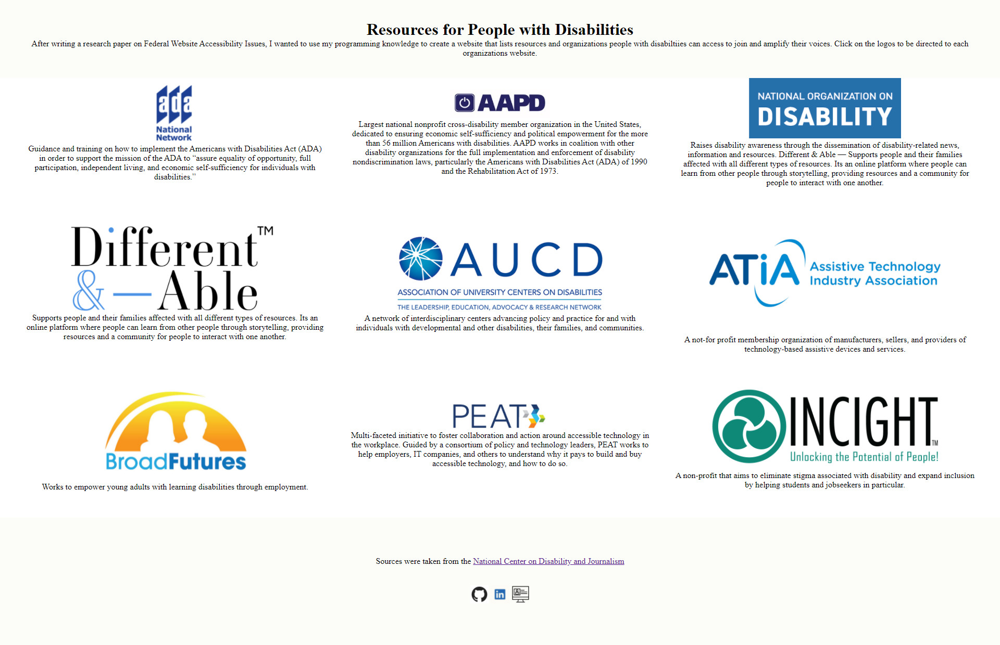

  # Disability Project

  ## Description  
  After writing a research paper on Federal Website Accessibility Issues, I wanted to use my programming knowledge to create a website that lists resources and organizations people with disabiltiies can access to join and amplify their voices.

  

  ## Questions
  To check out more of my projects, visit my [GitHub](https://github.com/aneesiii) page.
  To reach me with more questions email me at aneesah.saeed57@gmail.com. 